# mPlane Protocol Specification

- - -
__ed. Brian Trammell <trammell@tik.ee.ethz.ch>, Software Development Kit revision__
- - -

This document defines the present revision of the mPlane architecture for
coordination of heterogeneous network measurement components: probes and
repositories that measure, analyze, and store network measurements,
data derived from measurements, and other ancillary data about elements
of the network. The architecture is defined in terms of relationships between components and clients which communicate using the mPlane protocol, which is defined in this document.

This document is the work of the mPlane consortium, specifically B. Trammell, M. Kühlewind, M. Mellia, A. Finamore, S. Pentassuglia, G. De Rosa, F. Invernizzi, M. Milanesio, D. Rossi, S. Niccolini, I. Leontiadis, T. Szemethy, B. Szabó, R. Winter, M. Faath, B. Donnet, and D. Papadimitriou. It reflects Version 1 of the mPlane protocol.

## Changes from D1.4

This document differs from the revision of the protocol documented in the mPlane consortium's Deliverable 1.4 in the following points; all of these changes are interoperable with the protocol as defined there:

- Addition of augmented registry information.
- Addition of tokens to envelopes.
- Clarification that interrupts are intended to return pending results.
- Reorganization of architecture section for clarity.

# mPlane Architecture

## Introduction to the Architecture

mPlane is built around an architecture in which **components** provide network measurement services and access to stored measurement data which they advertise via **capabilities** completely describing these services and data. A **client** makes use of these capabilities by sending **specifications** that respond to them back to the components. Components may then either return **results** directly to the clients or sent to some third party via **indirect export** using an external protocol. The capabilities, specifications, and results are carried over the mPlane **protocol**, defined in detail in this document. An mPlane measurement infrastructure is built up from these basic blocks.

Components can be roughly classified into **probes** which generate measurement data and **repositories** which store and analyze measurement data, though the difference betweem a probe and a repository in the architecture is merely a matter of the capabilities it provides. Components can be pulled together into an infrastructure by a **supervisor**, which presents a client interface to subordinate components and a component interface to superordinate clients, aggregating capabilities into higher-level measurements and distributing specifications to perform them.

A client which provides automation support for measurement iteration in troubleshooting and root cause analysis is called a **reasoner**.

This arrangement is shown in schematic form in the diagram below.

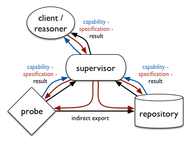

The mPlane protocol is, in essence, a self-describing, error- and delay-tolerant remote procedure call (RPC) protocol: each capability exposes an entry point in the API provided by the component; each specification embodies an API call; and each result returns the results of an API call.

mPlane differs from a simple RPC facility in several important ways, detailed in the subsections below. Each of these properties of the mPlane architecture and protocol follows from requirements which themselves were derived from an analysis of a set of specific use cases defined in (mPlane Deliverable 1.1)[https://www.ict-mplane.eu/sites/default/files//public/public-page/public-deliverables/324mplane-d11.pdf], though the aim was to define an architecture applicable to a wider set of situations than these specific use cases.

### Flexibility and extensibility

First, given the heterogeneity of the measurement tools and techniques applied, it is necessary for the protocol to be as *flexible* and *extensible* as possible. Therefore, the architecture in its simplest form consists of only two entities and one relationship, as shown in the diagram below: *n* clients connect to *m* components via the mPlane protocol. Anything which can speak the mPlane protocol and exposes capabilites thereby is a component; anything which can understand these capabilities and send specifications to invoke them is a client. Everything a component can do, from the point of view of mPlane, is entirely described by its capabilities. Capabilities are even used to expose optional internal features of the protocol itself, and provide a method for built-in protocol extensibility.

### Schema-centric measurement definition

Second, given the flexibility required above, the key to measurement interoperability is the comparison of data types. Each capability, specification, and result contains a _schema_, comprising the set of parameters required to execute a measurement or query and the set of columns that result. From the point of view of mPlane, the schema _completely_ describes the measurement. This implies that when exposing a measurement using mPlane, the developer of a component must build each capabilities it advertises such that the semantics of the measurement are captured by the set of columns in its schema; for practical guidance on this principle, see {{defining-measurement-schemas}} and {{defining-repository-schemas}}. The elements from which schemas can be built are captured in a type _registry_. The mPlane platform provides a core registry for common measurement use cases within the project, and the registry facility is itself fully extensible as well, for supporting new applications without requiring central coordination beyond the domain or set of domains running the application.

### Iterative measurement support

Third, the exchange of messages in the protocol was chosen to support *iterative* measurement in which the aggregated, high-level results of a measurement are used as input to a decision process to select the next measurement. Specifically, the protocol blends control messages (capabilities and specifications) and data messages (results) into a single workflow; this is shown in the diagram below.

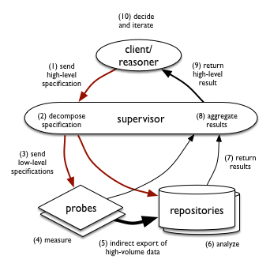

### Weak imperativeness

Fourth, the mPlane protocol is *weakly imperative*. A capability represents a willingness and an ability to perform a given measurement or execute a query, but not a guarantee or a reservation to do so. Likewise, a specification contains a set of parameters and a temporal scope for a measurement a client wishes a component to perform on its behalf, but execution of specifications is best-effort. A specification is not an instruction which must result either in a data or an error. This property arises from our requirement to support large-scale measurement infrastructures with thousands of similar components, including from resource- and connectivity-limited probes such as smartphones and customer-premises equipment (CPE) like home routers. These may be connected to a supervisor only intermittently. In this environment, the operability and conditions in which the probes find themselves may change more rapidly than can be practicably synchronized with a central supervisor; requiring reliable operation would

To support weak imperativeness, each message in the mPlane protocol is self-contained, and contains all the information required to understand the message. For instance, a specification contains the complete information from the capability which it responds to, and a result contains its specification. In essence, this distributes the state of the measurements running in an infrastructure across all components, and any state resynchronization that is necessary after a disconnect happens implicitly as part of message exchange. The failure of a component during a large-scale measurement can be detected and corrected after the fact, by examining the totality of the generated data.

Error handling in a weakly imperative environment is different to that in traditional RPC protocols. The exception facility provided by mPlane is designed only to report on failures of the handling of the protocol itself. Each component and client must make its best effort to interpret and process any authorized, well-formed mPlane protocol message it receives, ignoring those messages which are spurious or no longer relevant.

## Entities and Relationships

The entities in the mPlane protocol and the relationships among them are described in more detail in the subsections below.

### Components and Clients

Specifically, a component is any entity which implements the mPlane protocol specified
within this document, advertises its capabilities and accepts specifications which request the use of those capabilities. The measurements, analyses, storage facilities and other services provided by a component are completely defined by its capabilities.

Conversely, a __client__ is any entity which implements the mPlane protocol, receives capabilities published by one or more components, and sends specifications to those component(s) to perform  measurements and analysis.

Every interaction in the mPlane protocol takes place between a component and a client. Indeed, the simplest instantiation of the mPlane architecture consists of one or more clients taking capabilities from one or more components, and sending specifications to invoke those capabilities, as shown in the diagram below.

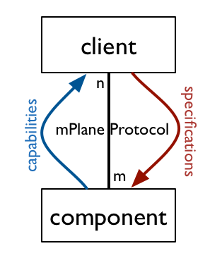

Indeed, an mPlane domain may consist of as little as a single client and a single component. In this arrangement, mPlane provides a measurement-oriented RPC mechanism.

### Probes and Repositories

Measurement components can be rougly divided into two categories: __probes__ and __repositories__. Probes perform measurements, and repositories provide access to stored measurements, analysis of stored measurements, or other access to related external data sources. External databases and data sources (e.g., routing looking glasses, WHOIS services, DNS, etc.) can be made available to mPlane clients through repositories acting as gateways to these external sources, as well.

Note that this categorization is very rough: what a component can do is completely described by its capabilities, and some components may combine properties of both probes and repositories.

### Supervisors and Federation

An entity which implements both the client and component interfaces can be used to build and federate domains of mPlane components. This __supervisor__ is responsible for collecting capabilities from a set of components, and providing
capabilities based on these to its clients. Application-specific algortihms at the supervisor aggregate the lower-level capabilities provided by these components into
higher-level capabilities exposed to its clients. This arrangement is shown in the figure below.

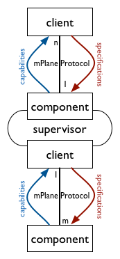

The set of components which respond to specifications from a single supervisor
is referred to as an mPlane __domain__. Domain membership is also determined by the issuer of the certificates identifying the clients, components, and supervisor, as detailed in {{access-control-in-https}}. Within a given domain, each client and component connects to only one supervisor. Underlying measurement components and clients may indeed participate in multiple domains, but these are separate entities from the point of view of the architecture. Interdomain measurement is supported by federation among supervisors: a local supervisor delegates measurements in a remote domain to that domain's supervisor, as shown in the figure below.

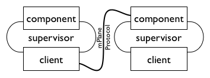

In addition to capability composition and specification decomposition, supervisors are responsible for client and component registration and authentication, as well as access control based on  identity information provided by the session protocol (HTTPS, WSS, or SSH) in the general case.

Since the logic for aggregating control and data for a given application is very specific to that application, note that there is no _generic_ supervisor implementation provided with the mPlane Reference Implementation.

### Reasoner

Within an mPlane domain, a special client known as a __reasoner__ may control automated or semi-automated iteration of measurements, working with a supervisor to iteratively run measurements using a set of components to perform root cause analysis. While the reasoner is key to the mPlane project, it is architecturally merely another client, though it will often be colocated with a supervisor for implementation convenience.

### External Interfaces to mPlane Entities

The mPlane protocol specified in this document is designed for the exchange of control messages in in an iterative measurement process, and the retrieval low volumes of highly aggregated data, primarily that leads to decisions about subsequent measurements and/or a final determination.

For measurements generating large amounts of data (e.g. passive observations of high-rate links, or high-frequency active measurements), mPlane supports __indirect export__. For indirect export, a client or supervisor directs one component (generally a probe) to send results to another component (generally a repository). This indirect export protocol is completely external to the mPlane protocol; the client must only know that the two components support the same protocol and that the schema of the data produced by the probe matches that accepted by the repository.

For exploratory analysis of large amounts of data at a repository, it is presumed that clients will have additional backchannel __direct access__ beyond those interactions mediated by mPlane. For instance, a repository backed by a relational database could have a web-based graphical user interface that interacts directly with the database.

## Message types and message exchange sequences

The basic messages in the mPlane protocol are capabilities, specifications, and results, as described above. The full protocol contains other message types as well. **Withdrawals** cancel capabilities (i.e., indicate that the component is no longer capable or willing to perform a given measurement) and **interrupts** cancel specifications (i.e., indicate that the component should stop performing the measurement). **Receipts** can be given in lieu of results for not-yet completed measurements or queries, and **redemptions** used to retrieve results referred to by a receipt. **Indirections** can be used by a component to delegate a specification to a different component. **Exceptions** can be sent by clients or components at any time to signal protocol-level errors to their peers.

In the nominal sequence, a capability leads to a specification leads to a result, where results may be transmitted by some other protocol. All the paths through the sequence of messages are shown in the diagram below; message types are described in {{message-types}} below. In the figure below, solid lines mean a message is sent in reply to the previous message in sequence (i.e. a component sends a capability, and a client replies or follows with a specification), and dashed lines mean a message is sent as a followup (i.e., a component sends a capability, then sends a withdrawal to cancel that capability). Messages at the top of the diagram are sent by components, at the bottom by clients.

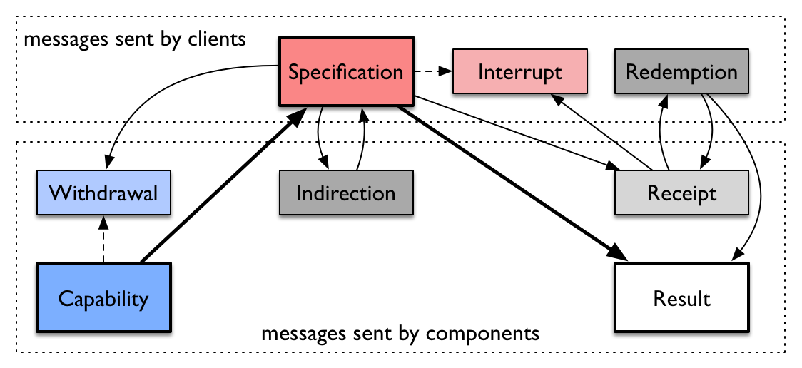

Separate from the sequence of messages, the mPlane protocol supports two connection establishment patterns:

  - __Client-initiated__ in which clients connect directly to components at known, stable, routable URLs. Client-initiated workflows are intended for use between clients and supervisors, for access to repositories, and for access to probes embedded within a network infrastructure.

  - __Component-initiated__ in which components initiate connections to clients. Component-initiated workflows are intended for use between components without stable routable addresses and supervisors, e.g. for small probes on embedded devices, mobile devices, or software probes embedded in browsers on personal computers behind network-address translators (NATs) or firewalls which prevent a client from establishing a connection to them.

Within a given mPlane domain, these patterns can be combined (along with indirect export and direct access) to facilitate complex interactions among clients and components according to the requirements imposed by the application and the deployment of components in the network.

## A Cooperative Measurement in an Example mPlane Domain

To illustrate how mPlane works within an example domain, consider the diagram below. Here we see a client/reasoner,
a supervisor, two probes, and a repository. The probes can perform simple latency and bandwidth measurements to a
selected target, and send their results to the repository and storage for analysis. The repository can compare present with past measurements, determine whether a given target has higher latency or lower bandwidth than baseline.

To bootstrap the system, the probes and repository first publish their capabilities to the supervisor; here,
each component knows the supervisor's address and establish a connection to initiate capability exchange.

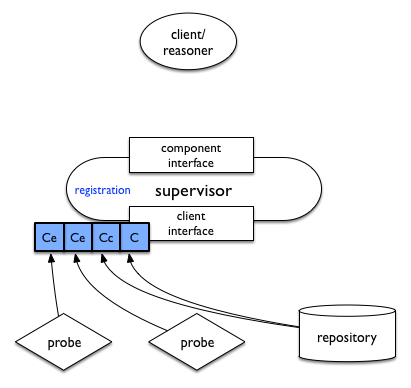

Each probe sends a capability ('Ce') advertising the ability to measure bandwidth and latency to a target given that target, and to export than information to a repository via an external protocol. The repository sends a capability ('Cc') that it can collect data matching what the probes can export, as well as a capability ('C') advertising comparison to baseline. The supervisor registers these, then composes higher-level capabilities based upon them.

When a client or reasoner initiates a connection to the supervisor, these composed capabilities are advertised to it, as shown below. Here, the two higher-level capabilities offered by the supervisor are "determine if a given target is nominal compared to baseline" and "show the recent measurements that deviate the most from the baseline".

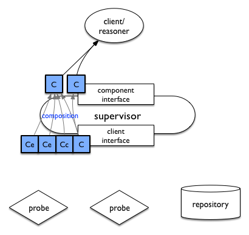

Suppose a user at the client decides to determine whether latency and bandwidth from the probes to a given targer are within expected values. It sends a specification corresponding to the first capability made available by the supervisor to the supervisor, which then decomposes it into specifications to the probes and repository. First, it instructs the probes to take measurements and send them to the repository via indirect export, as shown below.

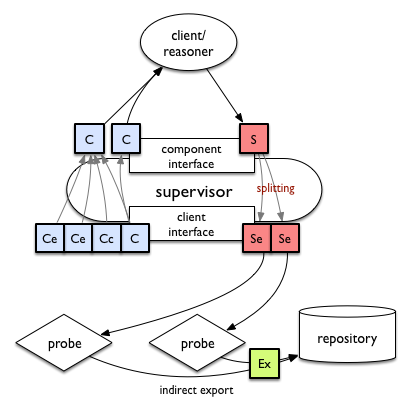

After enough measurements are completed, the supervisor then queries the repository to check that the measurements performed are within expected ranges given the history of measurements for that target, as shown below. Of course, the data from the probes becomes part of the repository's history for future queries about the target.

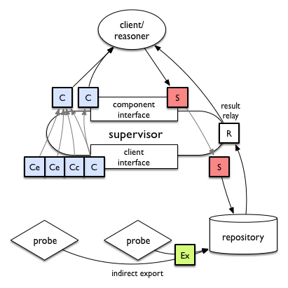

Note that not all interaction among components in an mPlane infrastructure must be mediated by the supervisor. This is particularly true of large-scale repositories, where (e.g.) visualization of large amounts of data may be done by accessing the repository's data directly using an external protocol, or by having the repository produce visualizations directly and providing these via HTTP.

## From Architecture to Protocol Specification

The remainder of this document builds the protocol specification based on this architecture from the bottom up. First, we define the protocol's information model from the element registry through the types of mPlane messages and the sections they are composed of. We then define a concrete representation of this information model using Javascript Object Notation (JSON, [RFC 7159](http://tools.ietf.org/html/7159)), and define bindings to HTTP over TLS as a session protocol. Finally, we show how to construct workflows using the protocol to build up complex measurement infrastructures, and detail the responsibilities of an mPlane supervisor.

# Protocol Information Model

The mPlane protocol is message-oriented, built on the representation- and session-protocol-independent exchange of messages between clients and components. This section describes the information model from the bottom up, starting from the element registry which defines the elements from which capabilities can be built, then detailing each type of message, and the sections that make these messages up.

## Element Registry

An element registry makes up the vocabulary by which mPlane components and clients can express the meaning of parameters, metadata, and result columns for mPlane statements. A registry is represented as a JSON ([RFC 7159](http://tools.ietf.org/html/7159)) object with the following keys:

- __registry-format__: currently `mplane-0`, determines the revision and supported features of the registry format.
- __registry-uri__: the URI identifying the registry. The URI must be dereferenceable to retrieve the canonical version of this registry.
- __registry-revision__: a serial number starting with 0 and incremented with each revision to the content of the registry.
- __includes__: a list of URLs to retrieve additional registries from. Included registries will be evaluated in depth-first order, and elements with identical names will be replaced by registries parsed later.
- __elements__: a list of objects, each of which has the following three keys:
    - __name__: The name of the element.
    - __prim__: The name of the primitive type of the element, from the list of primitives below.
    - __desc__: An English-language description of the meaning of the element.

Since the element names will be used as keys in mPlane messages, mPlane binds to JSON, and JSON mandates lowercase key names, element names must use only lowercase letters.

An example registry with two elements and no includes follows:

```
{ "registry-format": "mplane-0",
  "registry-uri", "http://ict-mplane.eu/registry/core",
  "registry-revision": 0,
  "includes": [],
  "elements": [
      { "name": "full.structured.name",
        "prim": "string",
        "desc": "A representation of foo..."
      },
      { "name": "another.structured.name",
        "prim": "string",
        "desc": "A representation of bar..."
      },
  ]
}
```

__Fully qualified__ element names consist of the element's name as an anchor after the URI from which the element came, e.g. `http://ict-mplane.eu/registry/core#full.structured.name`. Elements within the type registry are considered globally equal based on their fully qualified names. However, within a given mPlane message, elements are considered equal based on unqualified names.

### Structured Element Names

To ease understanding of mPlane type registries, element names are _structured_ by convention; that is, an element name is made up of the following structural parts in order, separated by the dot ('.') character:

- __basename__: exactly one, the name of the property the element specifies or measures. All elements with the same basename describe the same basic property. For example, all elements with basename '`source`' relate to the source of a packet, flow, active measurement, etc.; and elements with basename '`delay`'' relate to the measured delay of an operation.
- __modifier__: zero or more, additional information differentiating elements with the same basename from each other. Modifiers may associate the element with a protocol layer, or a particular variety of the property named in the basename. All elements with the same basename and modifiers refer to exactly the same property. Examples for the `delay` basename include `oneway` and `twoway`, differentiating whether a delay refers to the path from the source to the destination or from the source to the source via the destination; and `icmp` and `tcp`, describing the protocol used to measure the delay.
- __units__: zero or one, present if the quantity can be measured in different units.
- __aggregation__: zero or one, if the property is a metric derived from multiple singleton measurements. Supported aggregations are:
  - `min`: minimum value
  - `max`: maximum value
  - `mean`: mean value
  - `sum`: sum of values
  - `NNpct` (where NN is a two-digit number 01-99): percentile
  - `median`: shorthand for and equivalent to `50pct`.
  - `count`: count of values aggregated

When mapping mPlane structured names into contexts in which dots have special meaning (e.g. SQL column names or variable names in many programming languages), the dots may be replaced by underscores ('_'). When using external type registries (e.g. the IPFIX Information Element Registry), element names are not necessarily structured.

We anticipate the future development of an `mplane-1` revision of the registry format which directly supports simpler expression of structured names.

### Primitive Types

The mPlane protocol supports the following primitive types for elements in the type registry:

- __string__: a sequence of Unicode characters
- __natural__: an unsigned integer
- __real__: a real (floating-point) number
- __bool__: a true or false (boolean) value
- __time__: a timestamp, expressed in terms of UTC. The precision of the timestamp is taken to be unambiguous based on its representation.
- __address__: an identifier of a network-level entity, including an address family. The address family is presumed to be implicit in the format of the message, or explicitly stored. Addresses may represent specific endpoints or entire networks.
- __url__: a uniform resource locator

### Augmented Registry Information

Additional keys beyond __prim__, __desc__, and __name__ may appear in an mPlane registry to augment information about each element; these are not presently used by the reference implementation's information model but may be used by software built around the SDK.

Elements in the core registry at `http://ict-mplane.eu/registry/core` may contain the following augmented registry keys:

- __units__: If applicable, units in which the element is expressed; equal to the units part of a structured name if present.
- __ipfix-eid__: The element ID of the equivalent IPFIX ([RFC 7011](http://tools.ietf.org/html/7011) Information Element.
- __ipfix-pen__: The SMI Private Enterprise Number of the equivalent IPFIX Information Element, if any.

## Message Types

Workflows in mPlane are built around the _capability - specification - result_ cycle. Capabilities, specifications, and results are kinds of __statements__: a capability is a statement that a component can perform some action (generally a measurement); a specification is a statement that a client would like a component to perform the action advertised in a capability; and a result is a statement that a component measured a given set of values at a given point in time according to a specification.

Other types of messages outside this nominal cycle are referred to as __notifications__. Types of notifications include Withdrawals, Interrupts, Receipts, Redemptions, Indirections, and Exceptions. These notify clients or components of conditions within the measurement infrastructure itself, as opposed to directly containing information about measurements or observations.

Messages may also be grouped together into a single __envelope__ message. Envelopes allow multiple messages to be represented within a single message, for example multiple Results pertaining to the same Receipt; and multiple Capabilities or Specifications to be transferred in a single transaction in the underlying session protocol.

The following types of messages are supported by the mPlane protocol:

### Capability and Withdrawal

A __capability__ is a statement of a component's ability and willingness to perform a specific operation, conveyed from a component to a client. It does not represent a guarantee that the specific operation can or will be performed at a specific point in time.

A __withdrawal__ is a notification of a component's inability or unwillingness to perform a specific operation. It cancels a previously advertised capability. A withdrawal can also be sent in reply to a specification which attempts to invoke a capability no longer offered.

### Specification and Interrupt

A __specification__ is a statement that a component should perform a specific
operation, conveyed from a client to a component. It can be
conceptually viewed as a capability whose parameters have been filled in with
values.

An __interrupt__ is a notification that a component should stop performing a specific operation, conveyed from client to component. It terminates a previously sent specification. If the specification uses indirect export, the indirect export will simply stop running. If the specification has pending results, those results are returned in response to the interrupt.

### Result

A __result__ is a statement produced by a component that a particular measurement
was taken and the given values were observed, or that a particular operation or
analysis was performed and a the given values were produced. It can be
conceptually viewed as a specification whose result columns have been filled in with
values. Note that, in keeping with the stateless nature of the mPlane protocol, a
result contains the full set of parameters from which it was derived.

Note that not every specification will lead to a result being returned; for example,
in case of indirect export, only a receipt which can be used for future interruption
will be returned, as the results will be conveyed to a third component using an
external protocol.

### Receipt and Redemption

A __receipt__ is returned instead of a result by a component in response to a specification which either:

- will never return results, as it initiated an indirect export, or
- will not return results immediately, as the operation producing the results will have a long run time.

Receipts have the same content specification they are returned for.
A component may optionally add a __token__ section, which can be used
in future redemptions or interruptions by the client. The content of
the token is an opaque string generated by the component.

A __redemption__ is sent from a client to a component for a previously received receipt to attempt to retrieve delayed results. It may contain only the __token__ section, or all sections of the received receipt.

### Indirection

An __indirection__ is returned instead of a result by a component to indicate that the client should contact another component for the desired result.

### Exception

An __exception__ is sent from a client to a component or from a component to a client to signal an exceptional condition within the infrastructure itself. They are not meant to signal exceptional conditions within a measurement performed by a component; see {{error-handling-in-mplane-workflows}} for more.

### Envelope

An __envelope__ is used to contain other messages. Message containment is necessary in contexts in which multiple mPlane messages must be grouped into a single transaction in the underlying session protocol. It is legal to group any kind of message, and to mix messages of different types, in an envelope. However, in the current revision of the protocol, envelopes are primarily intended to be used for three distinct purposes:

- To return multiple results for a single receipt or specification if appropriate (e.g., if a specification has run repeated instances of a measurement on a schedule).
- To group multiple capabilities together within a single message (e.g., all the capabilities a given component has).
- To group multiple specifications into a single message (e.g., to simultaneously send a measurement specification along with a callback control specification).

## Message Sections

Each message is made up of sections, as described in the subsection below. The following table shows the presence of each of these sections in each of the message types supported by mPlane: "req." means the section is required, "opt." means it is optional; see the subsection on each message section for details.

| Section         | Capability | Specification | Result | Receipt     | Envelope |
| --------------- | ---------- | ------------- | ------ | ----------- |----------|
| Verb            | req.       | req.          | req.   | req.        |          |
| Content Type    |            |               |        |             | req.     |
| `version`       | req.       | req.          | req.   | req.        | req.     |
| `registry`      | req.       | req.          | req.   | opt.        |          |
| `label`         | opt.       | opt.          | opt.   | opt.        | opt.     |
| `when`          | req.       | req.          | req.   | req.        |          |
| `parameters`    | req./token | req.          | req.   | opt./token  |          |
| `metadata`      | opt./token | opt.          | opt.   | opt./token  |          |
| `results`       | req./token | req.          | req.   | opt./token  |          |
| `resultvalues`  |            |               | req.   |             |          |
| `export`        | opt.       | opt.          | opt.   | opt.        |          |
| `link`          | opt.       |               |        |             |          |
| `token`         | opt.       | opt.          | opt.   | opt.        | opt.     |
| `contents`      |            |               |        |             | req.     |

Withdrawals take the same sections as capabilities, and redemptions and interrupts
take the same sections as receipts; see the subsection on the token section, below.

### Message Type and Verb

The __verb__ is the action to be performed by the component. The following verbs
are supported by the base mPlane protocol, but arbitrary verbs may be specified
by applications:

- `measure`: Perform a measurement
- `query`: Query a database about a past measurement
- `collect`: Receive results via indirect export
- `callback`: Used for callback control in component-initated workflows

In the JSON representation of mPlane messages, the verb is the value of the key corresponding to the message's type, represented as a lowercase string (e.g. `capability`, `specification`, `result` and so on).

Roughly speaking, probes implement `measure` capabilities, and repositories
implement `query` and `collect` capabilities. Of course, any single component
can implement capabilities with any number of different verbs.

Within the Reference Implementation, the primary difference between `measure` and `query` is that the temporal scope of a `measure` specification is taken to refer to when the measurement should be scheduled, while the temporal scope of a  `query` specification is taken to refer to the time window (in the past) of a query.

Envelopes have no verb; instead, the value of the `envelope` key is the kind of messages the envelope contains, or `message` if the envelope contains a mixture of different unspecified kinds of messages.

### Version

The `version` section contains the version of the mPlane protocol to which the message conforms, as an integer serially incremented with each new protocol revision. This section is required in all messages. This document describes version 1 of the protocol.

### Registry

The `registry` section contains the URL identifying the element registry used by this message, and from which the registry can be retrieved. This section is required in all messages containing element names (statements, and receipts/redemptions/interrupts not using tokens for identification; see the `token` section below). The default core registry for mPlane is identified by `http://ict-mplane.eu/registry/core`.

### Label

The `label` section of a statement contains a human-readable label identifying it, intended solely for use when displaying information about messages in user interfaces. Results, receipts, redemptions, and interrupts inherit their label from the specification from which they follow; otherwise, client and component software can arbitrarily assign labels . The use of labels is optional in all messages, but as labels do greatly ease human-readability of arbitrary messages within user interfaces, their use is recommended.

mPlane clients and components should __never__ use the label as a unique identifier for a message, or assume any semantic meaning in the label -- the test of message equality and relatedness is always based upon the schema and values as in the section on message uniqueness and idempotence below.

### Temporal Scope (When)

The `when` section of a statement contains its __temporal scope__.

A temporal scope refers to when a measurement can be run (in a Capability), when it should be run (in a Specification), or when it was run (in a Result). Temporal scopes can be either absolute or relative, and may have an optional period, referring to how often single measurements should be taken.

The general form of a temporal scope (in BNF-like syntax) is as follows:

```
simple-when = <singleton> |            # A single point in time
              <range> |                # A range between two points in time
              <range> ' / ' <duration> # A range with a period

singleton = <iso8601> | # absolute singleton
            'now'       # relative singleton

range = <iso8601> ' ... ' <iso8601> | # absolute range
        <iso8601> ' + ' <duration> |  # relative range
        'now' ' ... ' <iso8061> |     # definite future
        'now' ' + ' <duration> |      # relative future
        <iso8601> ' ... ' 'now' |     # definite past
        'past ... now' |              # indefinite past
        'now ... future' |            # indefinite future
        <iso8601> ' ... ' 'future' |  # absolute indefinite future
        'past ... future' |           # forever

duration = [ <n> 'd' ] # days
           [ <n> 'h' ] # hours
           [ <n> 'm' ] # minute
           [ <n> 's' ] # seconds

iso8601 = <n> '-' <n> '-' <n> [' ' <n> ':' <n> ':' <n> [ '.' <n> ]
```

All absolute times are __always__ given in UTC and expressed in ISO8601 format with variable precision.

In capabilities, if a period is given it represents the _minumum_ period supported by the measurement; this is done to allow rate limiting. If no period is given, the measurement is not periodic. A capability with a period can only be fulfilled by a specification with period greater than or equal to the period in the capability. Conversely, a capability without a period can only be fulfilled by a specification without a period.

Within a result, only absolute ranges are allowed within the temporal scope, and refers to the time range of the measurements contributing to the result. Note that the use of absolute times here implies that the components and clients within a domain should have relatively well-synchronized clocks, e.g., to be synchronized using the Network Time Protocol ([RFC 5905](http://tools.ietf.org/html/5905)) in order for results to be temporally meaningful.

So, for example, an absolute range in time might be expressed as:

`when: 2009-02-20 13:02:15 ... 2014-04-04 04:27:19`

A relative range covering three and a half days might be:

`when: 2009-04-04 04:00:00 + 3d12h`

In a Specification for running an immediate measurement for three hours every seven and a half minutes:

`when: now + 3h / 7m30s`

In a Capability noting that a Repository can answer questions about the past:

`when: past ... now`.

In a Specification requesting that a measurement run from a specified point in time until interrupted:

`when: 2017-11-23 18:30:00 ... future`

#### Repeating Measurements

Within specifications, the temporal scope can be extended to support
__repeated measurement__. A repeated specification is conceptually
equivalent to a specification that is sent from the client to the
component once, then retained at the component and initiated multiple times.

The general form of a temporal scope in a repeated specification is as follows (BNF-like syntax):

```
repeated-when = # implicit inner scope of now
                'repeat' <outer-when> |
                # simple range/period
                'repeat' <outer-when> '{' <inner-when> '}' |
                # with crontab
                'repeat' <range> 'cron' <crontab> '{' <inner-when> '}'

outer-when = <range> ' / ' <duration>

inner-when = 'now' |
             'now' ' + ' <duration> |
             'now' ' + ' <duration> / <duration>

crontab = <seconds> <minutes> <hours> <days-of-month> <days-of-week> <months>

seconds = '*' | <seconds-or-minutes-list>
minutes = '*' | <seconds-or-minutes-list>
seconds-or-minutes-list = <n> [ ',' <seconds-or-minutes-list> ] # 0<=n<60

hours = '*' | <hours-list>
hours-list = <n> [ ',' <hour-list> ] # 0<=n<24

days-of-month = '*' | <days-of-month-list>
days-of-month-list = <n> [ ',' <days-of-month-list> ] # 0<n<=31

days-of-week = '*' | <days-of-week-list>
days-of-week-list = <n> [ ',' <days-of-week-list> ] # 0<=n<=7
                    # 0 = Sunday, 1 = Monday, ..., 7 = Sunday

months = '*' | <months-list>
months-list = <n> [ ',' <months-list> ] # 0<n<=12

when = <simple-when> | <repeated-when>
```

A repeated specification consists of an _outer_ temporal specification that governs how often and for how long the specification will repeat, and an _inner_ temporal specification which applies to each individual repetition. The inner temporal specifiation must _always_ be relative to the current time, i.e. the time of initiated of the repeated specification. If the inner temporal specification is omitted, the specification is presumed to have the relative singleton temporal scope of `now`.

A repeated specification can have a cron-like schedule. In this case
the _outer_ temporal specification only consists of a
_range_ scope to determine the time frame in which the cron-like
schedule is valid. The _crontab_ states the seconds, minutes,
hours, days of the week, days of the month, and months at which the
specification will repeat. An asterisk means to repeat at all
legal values for that field. The specification is only repeated
if all fields match.

Submitting a repeated specification will still result in a single receipt, or in multiple results. These multiple results, resulting either directly from a single repeated specification, or from the a redemption of a receipt resulting from a repeated specification, are grouped in an envelope message.

For example, a repeated specification to take measurements every second for five minutes, repeating once an hour indefinitely would be:

`when: repeat now ... future / 1h { now + 5m / 1s }`

This repeated specification is equivalent to the repeated submission of the same specification with a temporal scope of `when: { now + 5m / 1s }` once an hour until the specification is cancelled with an interrupt notification.

As a second example, a repeated specification to take measurements every second for five minutes, repeating every half hour within a specific timeframe would be:

`when: repeat 2014-01-01 13:00:00 ... 2014-06-01 14:00:00 / 30m { now + 5m / 1s }`

Likewise, this repeated specification is equivalent to the submission of the same specification with a temporal scope of `when: { now + 5m / 1s }` at `2014-01-01 13:00:00`, `2014-01-01 13:30:00`, `2014-01-01 14:00:00`, `2014-01-01 14:30:00`, and so on =, until (and including) `2014-06-01 13:30:00` and `2014-06-01 14:00:00`.

A repeated specification taking singleton measurements every hour indefinitely with an implicit inner temporal specification:

`when: repeat now ... future / 1h`

equivalent to submitting a specification with the temporal scope `now` hourly forever until interrupted.

A crontab specification which is repeated on the first Monday of each
month measuring every hour on that day for 5 minutes would be:
\texttt{when: repeat now ... future cron 0 0 * 1,2,3,4,5,6,7 1 * \{ now + 5m \} }

A repeated specification to take measurements each day
of the year at midnight would be:
\texttt{when: repeat now ... future cron 0 0 0 * * * }

### Parameters

The `parameters` section of a message contains an ordered list of the __parameters__ for a given measurement: values which must be provided by a client to a component in a specification to convey the specifics of the measurement to perform. Each parameter in an mPlane message is a __key-value pair__, where the key is the name of an element from the element registry. In specifications and results, the value is the value of the parameter. In capabilities, the value is a __constraint__ on the possible values the component will accept for the parameter in a subsequent specification.

Four kinds of constraints are currently supported for mPlane parameters:

- No constraint: all values are allowed. This is signified by the special constraint string '`*`'.
- Single value constraint: only a single value is allowed. This is intended for use for capabilities which are conceivably configurable, but for which a given component only supports a single value for a given parameter due to its own out-of-band configuration or the permissions of the client for which the capability is valid. For example, the source address of an active measurement of a single-homed probe might be given as '`source.ip4: 192.0.2.19`'.
- Set constraint: multiple values are allowed, and are explicitly listed, separated by the '`,`' character. For example, a multi-homed probe allowing two potential source addresses on two different networks might be given as '`source.ip4: 192.0.2.19, 192.0.3.21`'.
- Range constraint: multiple values are allowed, between two ordered values, separated by the special string '`...`'. Range constraints are inclusive. A measurement allowing a restricted range of source ports might be expressed as '`source.port: 32768 ... 65535`'
- Prefix constraint: multiple values are allowed within a single network, as specified by a network address and a prefix. A prefix constraint may be satisfied by any network of host address completely contained within the prefix. An example allowing probing of any host within a given /24 might be '`destination.ip4: 192.0.2.0/24`'.

Parameter and constraint values must be a representation of an instance of the primitive type of the associated element.

### Metadata

The `metadata` section contains measurement __metadata__: key-value pairs associated with a capability inherited by its specification and results. Metadata can also be thought of as immutable parameters. This is intended to represent information which can be used to make decisions at the client as to the applicability of a given capability (e.g. details of algorithms used or implementation-specific information) as well as to make adjustments at post-measurement analysis time when contained within results.

An example metadata element might be '`measurement.identifier: qof`', which identifies the underlying tool taking measurements, such that later analysis can correct for known peculiarities in the implementation of the tool.  Another example might be '`location.longitude = 8.55272`', which while not particularly useful for analysis purposes, can be used to draw maps of measurements.

### Result Columns and Values

Results are represented using two sections: `results` which identify the elements to be returned by the measurement, and `resultvalues` which contains the actual values. `results` appear in all statements, while `resultvalues` appear only in result messages.

The `results` section contains an ordered list of __result columns__ for a given measurement: names of elements which will be returned by the measurement. The result columns are identified by the names of the elements from the element registry.

The `resultvalues` section contains an ordered list of ordered lists (or, rather, a two dimensional array) of values of results for a given measurement, in row-major order. The columns in the result values appear in the same order as the columns in the `results` section.

Values for each column must be a representation of an instance of the primitive type of the associated result column element.

### Export

The `export` section contains a URL or partial URL for __indirect export__. Its meaning depends on the kind and verb of the message:

- For capabilities with the `collect` verb, the `export` section contains the URL of the collector which can accept indirect export for the schema defined by the `parameters` and `results` sections of the capability, using the protocol identified by the URL's schema. If the URL schema is `mplane-http`, result messages matching the capability can be directly sent to the collector at the given URL via HTTP `POST`. Otherwise, the binding between elements in the capability's registry and representations of these elements in the export protocol is protocol-specific.
- For capabilities with any verb other than `collect`, the `export` section contains either the URL of a collector to which the component can indirectly export results, or a URL schema identifying a protocol over which the component can export to arbitrary collectors.
- For specifications with any verb other than `collect`, the `export` section contains the URL of a collector to which the component should indirectly export results. A receipt will be returned for such specifiations.

If a component can indirectly export or indirectly collect using multiple protocols, each of those protocols must be identified by its own capability; capabilities with an `export` section can only be used by specifications with a matching `export` section.

The special export schema `mplane-http` implies that the exporter will POST mPlane result messages to the collector at the specified URL. All other export schemas are application-specific, and the mPlane protocol implementation is only responsible for ensuring the schemas and protocol identifiers match between collector and exporter.

### Link

The `link` section contains the URL to which messages in the next step in the workflow (i.e. a specification for a capability, a result or receipt for a specification) can be sent, providing indirection. The link URL must currently have the schema `mplane-http`, and refers to posting of messages via HTTP `POST`.

If present in a capability, the client must `POST` specifications for the given capability to the component at the URL given in order to use the capability, as opposed to simply posting them to the known or assumed URL for a component. If present in a specification, the component must `POST` results for the given specification back to the client at the URL given, as opposed to . See the section on workflows below for details.

If present in an indirection message returned for a specification by a component, the client must send the specification to the component at the URL given in the link in order to retrieve results or initiate measurement.

### Token

The `token` section contains an arbitrary string by which a message may be identified in subsequent communications in an abbreviated fashion. Unlike labels, tokens are not necessarily intended to be human-readable; instead, they provide a way to reduce redundancy on the wire by replacing the parameters, metadata, and results sections in messages within a workflow, at the expense of requiring more state at clients and components. Their use is optional.

Tokens are scoped to the association between the component and client in which they are first created; i.e., at a component, the token will be associated with the client's identity, and vice-versa at a client. Tokens should be created with sufficient entropy to avoid collision from independent processes at the same client or token reuse in the case of client or component state loss at restart.

If a capability contains a token, it may be subsequently withdrawn by the same component using a withdrawal containing the token instead of the parameters, metadata, and results sections.

If a specification contains a token, it may be answered by the component with a receipt containing the token instead of the parameters, metadata, and results sections. A specification containing a token may likewise be interrupted by the client with an interrupt containing the token. A component must not answer a specification with a token with a receipt or result containing a different token, but the token may be omitted in subsequent receipts and results.

If a receipt contains a token, it may be redeemed by the same client using a redemption containing the token instead of the parameters, metadata, and results sections.

When grouping multiple results from a repeating specification into an envelope, the envelope may contain the token of the repeating specification.

### Contents

The `contents` section appears only in envelopes, and is an ordered list of messages. If the envelope's kind identifies a message kind, the contents may contain only messages of the specified kind, otherwise if the kind is `message`, the contents may contain a mix of any kind of message.

## Message Uniqueness and Idempotence

Messages in the mPlane protocol are intended to support __state distribution__: capabilities, specifications, and results are meant to be complete declarations of the state of a given measurement. In order for this to hold, it must be possible for messages to be uniquely identifiable, such that duplicate messages can be recognized. With one important exception (i.e., specifications with relative temporal scopes), messages are _idempotent_: the receipt of a duplicate message at a client or component is a null operation.

### Message Schema

The combination of elements in the `parameters` and `results` sections, together with the registry from which these elements are drawn, is referred to as a message's __schema__. The schema of a measurement can be loosely thought of as the definition of the table, rows of which the message represents.

The schema contributes not only to the identity of a message, but also to the semantic intepretation of the parameter and result values. The meanings of element values in mPlane are dependent on the other elements present in the message; in other words, the key to interpreting an mPlane message is that _the unit of semantic identity is a message_. For example, the element '`destination.ip4`' as a parameter means "the target of an given active measurement" when together with an elements describing an active metric (e.g. '`delay.twoway.icmp.us`'), but "the destination of the packets in a flow" when together with other elements in result columns describing a passively-observed flow.

The interpretation of the semantics of an entire message is application-specific. The protocol does not forbid the transmission of messages representing semantically meaningless or ambiguous schemas.

### Message Identity

A message's identity is composed of its schema, together with its temporal scope, metadata, parameter values, and indirect export properties. Concretely, the full content of the `registry`, `when`, `parameters`, `metadata`, `results`, and `export` sections taken together comprise the message's identity.

One convenience feature complicates this somewhat: when the temporal scope is not absolute, multiple specifications may have the same literal temporal scope but refer to different measurements. In this case, the current time at the client or component when a message is invoked must be taken as part of the message's identity as well. Implementations may use hashes over the values of the message's identity sections to uniquely identify messages; e.g. to generate message tokens.

## Designing Measurement Schemas

*[**Editor's Note**: We need a place to answer the reviewer comment that we still haven't shown how traceroute works, and to more explicitly point out that the meaning of a schema must be taken over all parameters and results. ]*

# Representations and Session Protocols

The mPlane protocol is built atop an abstract data model in order to support multiple representations and session protocols. The canonical representation supported by the present reference implementation involves JSON ([RFC 7159](http://tools.ietf.org/html/7159)) objects transported via HTTP ([RFC 7230](http://tools.ietf.org/html/7230)) over TLS ([RFC 5246](http://tools.ietf.org/html/5246))(HTTPS).

## JSON representation

In the JSON representation, an mPlane message is a JSON object, mapping sections by name to their contents. The name of the message type is a special section key, which maps to the message's verb, or to the message's content type in the case of an envelope.

Each section name key in the object has a value represented in JSON as follows:

- `version` : an integer identifying the mPlane message version.
- `registry` : a URL identifying the registry from which element names are taken.
- `label` : an arbitrary string.
- `when` : a string containing a temporal scope, as described in the "Temporal Scope" subsection above.
- `parameters` : a JSON object mapping (non-qualified) element names, either to constraints or to parameter values, as appropriate, and as described in the "Parameters" subsection above.
- `metadata` : a JSON object mapping (non-qualified) element names to metadata values.
- `results` : an array of element names.
- `resultvalues` : an array of arrays of element values in row major order, where each row array contains values in the same order as the element names in the `results` section.
- `export` : a URL for indirect export.
- `link` : a URL for message indirection.
- `token` : an arbitrary string.
- `contents` : an array of objects containing messages.

### Textual representations of element values

Each primitive type is represented as a value in JSON as follows, following the [Textual Representation of IPFIX Abstract Data Types (RFC7373)](http://tools.ietf.org/html/7373).

Natural and real values are represented in JSON using native JSON representation for numbers.

Booleans are represented by the reserved words `true` and `false`.

Strings and URLs are represented as JSON strings subject to JSON escaping rules.

Addresses are represented as dotted quads for IPv4 addresses as they would be in URLs, and canonical IPv6 textual addresses as in section 2.2 of [RFC 4291](http://tools.ietf.org/html/4291) as updated by section 4 of [RFC 5952](http://tools.ietf.org/html/4291). When representing networks, addresses may be suffixed as in CIDR notation, with a '`/`' character followed by the mask length in bits n, provided that the least significant 32 − n or 128 − n bits of the address are zero, for IPv4 and IPv6 respectively.

Timestamps are represented in [RFC 3339](http://tools.ietf.org/html/3339) and ISO 8601, with two important differences. First, all mPlane timestamps are are expressed in terms of UTC, so time zone offsets are neither required nor supported, and are always taken to be 0. Second, fractional seconds are represented with a variable number of digits after an optional decimal point after the fraction.

### Example mPlane Capabilities and Specifications

To illustrate how mPlane messages are encoded, we consider first two capabilities for a very simple application -- ping -- as mPlane JSON capabilities. The following capability states that the component can measure ICMP two-way delay from 192.0.2.19 to anywhere on the IPv4 internet, with a minumum delay between individual pings of 1 second, returning aggregate statistics:

```
{
  "capability": "measure",
  "version":    0,
  "registry":   "http://ict-mplane.eu/registry/core",
  "label":      "ping-aggregate",
  "when":       "now ... future / 1s",
  "parameters": {"source.ip4":      "192.0.2.19",
                 "destination.ip4": "*"},
  "results":    ["delay.twoway.icmp.us.min",
                 "delay.twoway.icmp.us.mean",
                 "delay.twoway.icmp.us.50pct",
                 "delay.twoway.icmp.us.max",
                 "delay.twoway.icmp.count"]
}
```

In contrast, the following capability would return timestamped singleton delay measurements given the same parameters:

```
{
  "capability": "measure",
  "version":    0,
  "registry":   "http://ict-mplane.eu/registry/core",
  "label":      "ping-singletons",
  "when":       "now ... future / 1s",
  "parameters": {"source.ip4":      "192.0.2.19",
                 "destination.ip4": "*"},
  "results":    ["time",
                 "delay.twoway.icmp.us"]
}
```

A specification is merely a capability with filled-in parameters, e.g.:

```
{
  "specification":  "measure",
  "version":        0,
  "registry":       "http://ict-mplane.eu/registry/core",
  "label":          "ping-aggregate",
  "token":          "0f31c9033f8fce0c9be41d4942c276e4",
  "when":           "now + 30s / 1s",
  "parameters": {"source.ip4":      "192.0.2.19",
                 "destination.ip4": "192.0.2.33"},
  "results":    ["delay.twoway.icmp.us.min",
                 "delay.twoway.icmp.us.mean",
                 "delay.twoway.icmp.us.50pct",
                 "delay.twoway.icmp.us.max",
                 "delay.twoway.icmp.count"]
}
```

Results are merely specifications with result values filled in and an absolute temporal scope:

```
{
  "result":         "measure",
  "version":        0,
  "registry":       "http://ict-mplane.eu/registry/core",
  "label":          "ping-aggregate",
  "token":          "0f31c9033f8fce0c9be41d4942c276e4",
  "when":           "2014-08-25 14:51:02.623 ... 2014-08-25 14:51:32.701 / 1s",
  "parameters": {"source.ip4":      "192.0.2.19",
                 "destination.ip4": "192.0.2.33"},
  "results":    ["delay.twoway.icmp.us.min",
                 "delay.twoway.icmp.us.mean",
                 "delay.twoway.icmp.us.50pct",
                 "delay.twoway.icmp.us.max",
                 "delay.twoway.icmp.count"],
  "resultvalues": [ [ 23901,
                      29833,
                      27619,
                      66002,
                      30] ]
}
```

*[**Editor's Note**: Add a traceroute example.]*

## mPlane over HTTPS

The default session protocol for mPlane messages is HTTP over TLS with mandatory mutual authentication. This grants confidentiality and integrity to the exchange of mPlane messages through a link security approach, and is transparent to the client. HTTP over TLS was chosen in part because of its ubiquitous implementation on many platforms.

An mPlane component may act either as a TLS server or a TLS client, depending on the workflow. When an mPlane client initiates a connection to a component, it acts as a TLS client, and must present a client certificate, which the component will verify against its allowable clients and map to an internal identity for making access control decisions before proceeding. The component, on the other hand, acts as a TLS server, and must present a server certificate, which the client will verify against its accepted certificates for the component before proceeding. When an mPlane component initiates a connection to a client (or, more commonly, the client interface of a supervisor), this arragmenent is reversed: the component acts as a TLS client, the client as a TLS server, and mutual authentication is still mandatory. The mPlane client or component has an __identity__ which is algorithmically derived from it's certificate's Distinguished Name (DN).

mPlane envisions a bidirectional message channel; however, HTTPS is not a bidirectional protocol. This makes it necessary to specify mappings between this bidirectional message channel and the sequence of HTTPS requests and responses for each deployment scenario. These mappings are given in the Workflows section below. Note that in a given mPlane domain, any or all of these mappings may be used simultaneously.

When sending mPlane messages over HTTPS, the Content-Type of the message indicates the message representation. The MIME Content-Type for mPlane messages using JSON representation over HTTPS is `application/x-mplane+json`. When sending exceptions in HTTP response bodies, the response should contain an appropriate 400 (Client Error) or 500 (Server Error) response code. When sending indirections, the response should contain an appropriate 300 (Redirection) response code. Otherwise, the response should contain response code 200 OK.

### mPlane PKI for HTTPS

The clients and components within an mPlane domain generally shares a single certificate issuer, specific to a single mPlane domain. Issuing a certificate to a client or component then grants it membership within the domain. Any client or component within the domain can then communicate with components and clients within that domain. In a domain containing a supervisor, all clients and components within the domain can connect to the supervisor. This is necessary to scale mPlane domains to large numbers of clients and components without needing to specifically configure each client and component identity at the supervisor.

In the case of interdomain federation, where supervisors connect to each other, each supervisor will have its own issuer. In this case, each supervisor must be configured trust each remote domain's issuer, but only to identify that domain's supervisor. This compartmentalization is necessary to keep one domain from authorizing components and clients within another domain.

### Access Control in HTTPS

For components with simple authorization policies (e.g., many probes), the ability to establish a connection implies verification of a client certificate valid within the domain, and further implies authorization to continue with any capability offered by the component. Conversely, in component-initiated workflows (see below), the ability of a component to connect to the supervisor implies that the supervisor will trust capabilities from that component.

For components with more complex policies (e.g., many repositories), an identity based on the DN of the peer's certificate is mapped to an internal identity on which access control decisions can be made. For access control purposes, the identity of an mPlane client or component is based on the Distinguished Name extracted from the certificate, which uniquely and securely identifies the entity carrying it.

In an mPlane domain containing a supervisor, each component trusts its supevisor completely, and accepts every message that can be identified as coming from the supervisor. Access control enforcement takes place on the supervisor, using a RBAC approach: an identity based on the DN extracted from their certificate of the clients is mapped to a role. Each role has access only to a subset of the whole set of capabilities provided by that to a supervisor, as composed from the capabilities offered by the associated components, according to its privileges. Therefore, any client will only have access to capabilities at the supervisor that it is authorized to execute. The same controls are enforced on specifications.

### Paths in mPlane URLs

*[**Editor's Note**: Add text here on how mPlane components and clients can encode additional information in URLs via the link section. Note ease of implementation for many web application frameworks of using different paths for different types of messages. There are some additional conventions used for mPlane over HTTPS. If a client or component has a URL it should use that for all interactions with its peer. However, if a client can only discover a component's address, it should `GET /capabilities` to get that component's capabilities. If a client posts a specification for a capability that does not contain a link to a component, and only has that component's address, it should `POST` the specification to `/specification`. If a component wants to return results to a client and only has the client's address, and the corresponding specification does not have a link, it should `POST` the result to `/result`.]*

## mPlane over WebSockets over TLS

Though not presently implemented by the reference implementation, the mPlane protocol specification is designed such that it can also use the WebSockets protocol as specified in [RFC 6455](http://tools.ietf.org/html/6455). Once an WebSockets connection is established, mPlane messages can be exchanged bidirectionally over the channel. A client may establish a connection to a component, or a component to a client, as required for a given application.

Access control in WebSockets is performed as in the HTTPS case: both clients and components are identified by certificates, identities derived from certificate DN, and domain membership is defined by certificate issuer.

Implementation and further specification of WebSockets as a session layer is a matter for future work.

## mPlane over SSH

Though not presently implemented by the reference implementation, the mPlane protocol specification is designed such that it can also use the Secure Shell (SSH) protocol as a session layer. In the SSH binding, a connection initiator (SSH client) identifies itself with an RSA, DSA, or ECDSA public key, which is bound to a specific identity, and the connection responder (SSH server) identifies itself with a host public key. Once an SSH connection is established, mPlane messages can be exchanged bidirectionally over the channel.

When using SSH as a session layer, clients and components are identified by SSH keys. SSH keys are not very human-readable identifiers, and as such must be mapped to identifiers at each component, client, and supervisor, on which roles can be assigned and access control decisions made. Additionally, SSH keys are not signed by an issuer, so there is no PKI-based definition of membership within a domain as with HTTPS. The need to specifically manage keys for every client and component, and the mappings to identities used in RBAC, will tend to limit the use of SSH to small domains.

Implementation and further specification of SSH as a session layer is a matter for future work.

# Workflows

As noted above, mPlane protocol supports three patterns of workflow: __client-initiated__, __component-initiated__, and __indirect export__. These workflow patterns can be combined into complex interactions among clients and components in an mPlane infrastructure. In the subsections below, we illustrate these workflows as they operate over HTTPS.

In this section, the following symbols have the following meanings:


| Symbol | Description                           |
| ------ | --------------------------------------|
| C      | Capability                            |
| Ccb    | Callback Capability                   |
| Ce     | Export Capability                     |
| Cc     | Collect Capability                    |
| S      | Specification                         |
| Scb    | Callback Specification                |
| Se     | Export Specification                  |
| R      | Result                                |
| Rc     | Receipt                               |
| Rd     | Redemption                            |
| Ex     | External protocol for indirect export |
| I      | Interrupt                             |

Colors are as elsewhere in the document: blue for capabilities and capability-related messages, red for specifications, and black for results.

## Client-Initiated

Client-initiated workflows are appropriate for stationary components, i.e., those with stable, routable addresses, which can therefore act as HTTPS servers. This is generally the case for supervisors, large repositories, repositories acting as gateways to external data sources, and certain large-scale or public probes. The client-initiated pattern is illustrated below:

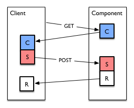

Here, the client opens an HTTPS connection the the component, and GETs a capability message, or an envelope containing capability messages, at a known URL. It then subsequently uses these capabilities by POSTing a specification, either to a known URL or to the URL given in the `link` section of the capability. The HTTP response to the POSTed specification contains either a result directly, or contains a receipt which can be redeemed later by POSTing a redemption to the component. This latter case is illustrated below:

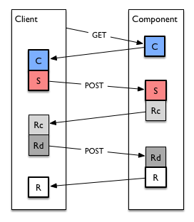

In a client-initiated workflow with a delayed result, the client is responsible for polling the component with a redemption at the appropriate time. For measurements (i.e. specifications with the verb '`measure`'), this time is known as it is defined by the end of the temporal scope for the specification.

Note that in client-initiated workflows, clients may store capabilities from components for later use: there may be a significant delay between retrieval of capabilities and transmission of specifications following from those capabilities. It is _not_ necessary for a client to check to see whether a given capability it has previously retrieved is still valid before

### Capability Discovery

For direct client-initiated workflows, the URL(s) from which to GET capabilities is a client configuration parameter. The client-initiated workflow also allows indirection in capability discovery. Instead of GETting capabilities direct from a component, they can also be retrieved from a _capability discovery server_ containing capabilities for multiple components providing capabilities via client-initiated workflows. These components are then identified by the `link` section of each capability. The capabilities may be grouped in an envelope retrieved from the capability discovery server, or linked to in an HTML object retrieved therefrom.

In this way, a client needs only be configured with a single URL for capability discovery, instead of URLs for each component with which it wants to communicate.

This arrangement is shown in the figure below.

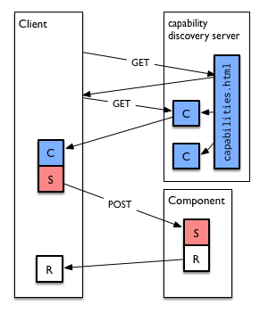

## Component-Initiated

Component-initiated workflows are appropriate for components which do not have stable routable addresses (i.e., are behind NATs and/or are mobile), and which are used by clients that do. Common examples of such components are lightweight probes on mobile devices and customer equipment on access networks, interacting directly with a supervisor.

In this case, the usual client-server relationship is reversed, as shown in the figure below.

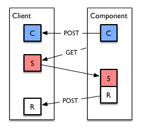

Here, when the component becomes available, it opens an HTTPS connection to the client and POSTs its capabilities to a known, configured URL at the supervisor. The supervisor remembers which capabilities it wishes to use on which components, and prepares specifications for later retrieval by the client.

The component then polls the supervisor, opening HTTPS connections and attempting to GET a specification from a known URL. The client will either respond 404 Not Found if the client has no current specification for the component, or with a specification to run matching a previously POSTed capability. After completing the measurement specified, the component then calls back and POSTs the results to the supervisor at a known URL.

In this case, the component must be configured with the client's URL(s).

### Callback Control

Callback control allows the supervisor to specify to the component _when_ it should call back, in order to allow centralized scheduling of component-initiated workflows, as well as to allow an mPlane infrastructure using component-initiated workflows to scale. Continuous polling of a client by thousands of components would put a network under significant load, and the polling delay introduces a difficult tradeoff between timeliness of specification and polling load. mPlane uses the `callback` verb with component-initiated workflows in order to allow the supervisor fine-grained control over when components will call back.

To use callback control, the component advertises the following capability along with the others it provides:

```
{
 'capability': 'callback',
 'version':    0,
 'registry':   'http://ict-mplane.eu/registry/core',
 'when':       'now ... future',
 'parameters': {},
 'results':    []
}
```

Then, when the component polls the client the first time, it responds with an envelope containing two specifications: the measurement it wants the client to perform, and a callback specification, containing the time at which the client should poll again in the temporal scope; e.g. as follows:

```
{
 'specification': 'callback',
 'version':       0,
 'registry':      'http://ict-mplane.eu/registry/core',
 'when':          '2014-09-08 12:40:00.000',
 'parameters':    {},
 'results':       []
}
```

Callback control is illustrated below:

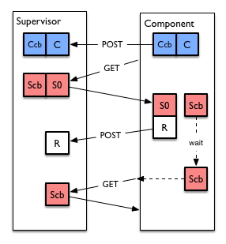

Note that if the supervisor has no work for the component, it returns a single callback specification as opposed to returning 404. Note that subsequent callback control specification to a component can have different time intervals, allowing a supervisor fine-grained control on a per-component basis of the tradeoff between polling load and response time.

Components implementing component-initiated workflows should support callback control in order to ensure the scalability of large mPlane infrastructures.

## Indirect Export

Many common measurement infrastructures involve a large number of probes exporting large volumes of data to a (much) smaller number of repositories, where data is reduced and analyzed. Since (1) the mPlane protocol is not particularly well-suited to the bulk transfer of data and (2) fidelity is better ensured when minimizing translations between representations, the channel between the probes and the repositories is in this case external to mPlane. This **indirect export** channel runs either a standard export protocol such as IPFIX, or a proprietary protocol unique to the probe/repository pair. It coordinates an __exporter__ which will produce and export data with a __collector__ which will receive it. All that is necessary is that (1) the client, exporter, and collector agree on a schema to define the data to be transferred and (2) the exporter and collector share a common protocol for export.

An example arrangement is shown in the figure below:


Here, we consider a client speaking to an exporter and a collector. The client first receives an export capability from the exporter (with verb `measure` and with a protocol identified in the `export` section) and a collection capability from the collector (with the verb `collect` and with a URL in the `export` section describing where the exporter should export), either via a client-initiated workflow or a capability disovery server. The client then sends a specification to the exporter, which matches the schema and parameter constraints of both the export and collection capabilities, with the collector's URL in the `export` section.

The exporter initiates export to the collector using the specified protocol, and replies with a receipt that can be used to interrupt the export, should it have an indefinite temporal scope. In the meantime, it sends data matching the capability's schema directly to the collector.

This data, or data derived from the analysis thereof, can then be subsequently retrieved by a client using a client-initiated workflow to the collector.

## Error Handling in mPlane Workflows

Any component may signal an error to its client or supervisor at any time by
sending an exception message. While the taxonomy of error messages is at
this time left up to each individual component, given the weakly imperative
nature of the mPlane protocol, exceptions should be used
sparingly, and only to notify components and clients of errors which may
require external human intervention to correct.

Specifically, components in component-initiated workflows
should not use the exception mechanism for common error conditions (e.g.,
device losing connectivity for small network-edge probes) -- specifications
sent to such components are expected to be best-effort. Exceptions should
also not be returned for specifications which would normally not be delayed
but are due to high load -- receipts should be used in this case, instead.
Likewise, specifications which cannot be fulfilled because they request the
use of capabilities that were once available but are no longer should be
answered with withdrawals.

Exceptions *should* always be sent in reply to messages sent to
components or clients which cannot be handled due to a syntactic or semantic
error in the message itself.

## The Role of the Supervisor

From the point of view of the mPlane protocol, a supervisor is merely a combined component and client. The logic binding client and component interfaces within the supervisor is application-specific, as it involves the following operations according to the semantics of each application:

- translating lower-level capabilities from subordinate components into higher-level (composed) capabilities, according to the application's semantics
- translating higher-level specifications from subordinate components into lower-level (decomposed) specifications
- relaying or aggregating results from subordinate components to supervisor clients

The workflows on each side of the supervisor are independent; indeed, the supervisor itself will generally respond to client-initiated exhanges, and use both component-initiated and supervisor-initiated exchanges with subordinate components.

An example combination of workflows at a supervisor is shown below:


Here we see a a very simple arrangement with a single client using a single supervisor to perform measurements using a single component. The component uses a component-initiated workflow to associate with a supervisor, and the client uses a client-initiated workflow.

First, the component registers with the supervisor, POSTing its capabilities. The supervisor creates composed capabilities derived from these component capabilities, and makes them available to its client, which GETs them when it connects.

The client then initiates a measurement by POSTing a specification to the supervisor, which decomposes it into a more-specific specification to pass to the component, and hands the client a receipt for a the measurement. When the component polls the supervisor -- controlled, perhaps, by callback control as described above -- the supervisor passes this derived specification to the component, which executes it and POSTs its results back to the supervisor. When the client redeems its receipt, the supervisor returns results composed from those received from the component.

This simple example illustrates the three main responsibilities of the supervisor, which are described in more detail below.

### Component Registration

In order to be able to use components to perform measurements, the supervisor must __register__ the components associated with it. For client-initiated workflows -- large repositories and the address of the components is often a configuration parameter of the supervisor. Capabilities describing the available measurements and queries at large-scale components can even be part of the supervisor's externally managed static configuration, or can be dynamically retrieved and updated from the components or from a capability discovery server.

For component-initiated workflows, components connect to the supervisor and POST capabilities and withdrawals, which requires the supervisor to maintain a set of capabilities associated with a set of components currently part of the mPlane infrastructure it supervises.

### Client Authentication

For many components -- probes and simple repositories -- very simple authentication often suffices, such that any client with a certificate with an issuer recognized as valid is acceptable, and all capabilities are available to. Larger repositories often need finer grained control, mapping specific peer certificates to identities internal to the repository's access control system (e.g. database users).

In an mPlane infrastructure, it is therefore the supervisor's responsbility to map client identities to the set of capabilities each client is authorized to access. This mapping is part of the supervisor's configuration.

### Capability Composition and Specification Decomposition

The most dominant responsibility of the supervisor is _composing_ capabilities from its subordinate components into aggregate capabilities, and _decomposing_ specifications from clients to more-specific specifications to pass to each component. This operation is always application-specific, as the semantics of the composition and decomposition operations depend on the capabilities available from the components, the granularity of the capabilities to be provided to the clients. It is for this reason that the mPlane reference implementation does not provide a generic supervisor.
